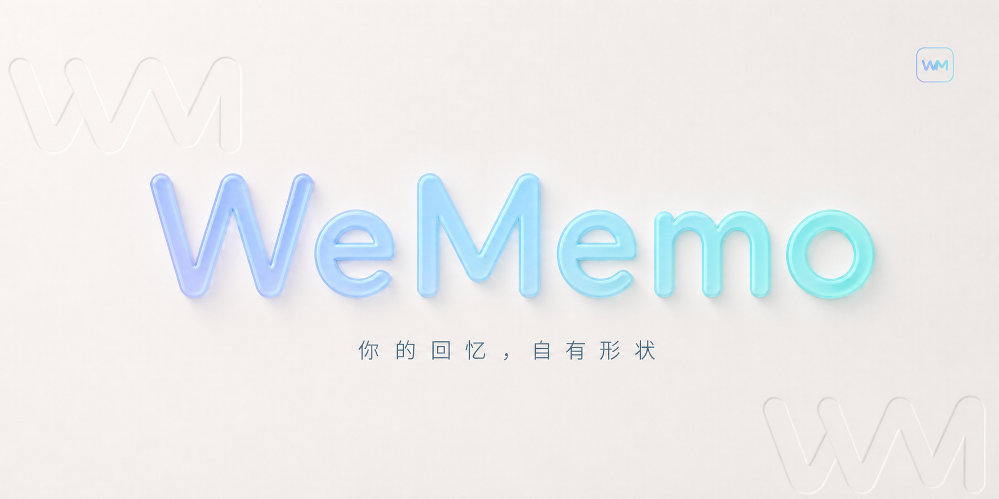

<p align="center">
  
</p>

<h1 align="center">微忆 · WeMemo</h1>

<p align="center">
  微忆（WeMemo）是一个<strong>完全本地</strong>的微信<strong>实时</strong>聊天记录查看、分析与导出工具。<br>
  它可以获取你的微信聊天记录并将其导出，还可以根据你的聊天记录为你生成独一无二的数据与年度报告。
</p>

<p align="center">
  <a href="https://github.com/taopaox/WeMemo/stargazers"></a>
  <a href="https://github.com/taopaox/WeMemo/network/members"></a>
  <a href="https://github.com/taopaox/WeMemo/releases"></a>
</p>

> [!TIP]
> 仅支持微信 **4.0 及以上**版本
>
> 如果导出聊天记录后，想深入分析聊天内容可以试试 [ChatLab](https://chatlab.fun/)


## 主要功能

- 本地实时查看聊天记录
- 朋友圈图片、视频、**实况**的预览和解密
- 统计分析与群聊画像
- 年度报告与可视化概览
- 导出聊天记录为 HTML 等格式
- HTTP API 接口（面向开发者）
- 查看完整能力清单：[详细功能](#详细功能清单)

## 支持平台与设备

| 平台 | 设备/架构 | 安装包 |
|------|----------|--------|
| Windows | Windows10+、x64 | `.exe` |
| macOS | Apple Silicon（M 系列，arm64） | `.dmg` |
| Linux | x64 设备（amd64） | `.AppImage`、`.tar.gz` |

## 快速开始

成品版本构建完成后，可前往 [Releases](https://github.com/taopaox/WeMemo/releases) 下载并安装。

## 详细功能清单

| 功能模块 | 说明 |
|---------|------|
| **聊天** | 解密聊天中的图片、视频、实况；支持**修改**本地消息 |
| **消息防撤回** | 防止其他人发送的消息被撤回 |
| **实时弹窗通知** | 新消息到达时提供桌面弹窗提醒，便于及时查看重要会话，提供黑白名单功能 |
| **私聊分析** | 统计好友间消息数量；分析消息类型与发送比例；查看消息时段分布等 |
| **群聊分析** | 查看群成员详细信息；分析群内发言排行、活跃时段和媒体内容 |
| **年度报告** | 生成按年统计的年度报告，或跨年度的长期历史报告 |
| **双人报告** | 选择指定好友，基于双方聊天记录生成专属分析报告 |
| **消息导出** | 将微信聊天记录导出为多种格式：JSON、HTML、Markdown、TXT、Excel、CSV、PGSQL、ChatLab专属格式等 |
| **朋友圈** | 解密朋友圈图片、视频、实况；导出朋友圈内容；拦截朋友圈的删除与隐藏操作； |
| **联系人** | 导出微信好友、群聊、公众号信息；找回部分曾经的好友 |
| **HTTP API 映射** | 将本地消息能力映射为 HTTP API，便于对接外部系统、自动化脚本与二次开发 |

## HTTP API

WeMemo 提供本地 HTTP API 服务，支持通过接口查询消息数据，可用于与其他工具集成或二次开发。

- **启用方式**：设置 → API 服务 → 启动服务
- **默认端口**：5031
- **访问地址**：`http://127.0.0.1:5031`
- **支持格式**：原始 JSON 或 [ChatLab](https://chatlab.fun/) 标准格式

完整接口文档：[点击查看](docs/HTTP-API.md)

## 面向开发者

如果你想从源码构建或为项目贡献代码，请遵循以下步骤：

```bash
# 1. 克隆项目到本地
git clone https://github.com/taopaox/WeMemo.git
cd WeMemo

# 2. 安装项目依赖
npm install

# 3. 运行应用（开发模式）
npm run dev
```

## 致谢

- 本项目由 [WeFlow](https://github.com/jacklilyhello/WeFlow) 迁移并重新品牌化，保留上游许可证与作者信息
- [密语 CipherTalk](https://github.com/ILoveBingLu/miyu) 为本项目提供了基础框架
- [WeChat-Channels-Video-File-Decryption](https://github.com/Evil0ctal/WeChat-Channels-Video-File-Decryption) 提供了视频解密相关的技术参考

## 推广与合作

如果您对 **WeMemo** 有兴趣，或者希望与我们展开深度合作或投放你的广告，欢迎随时通过邮件取得联系。我们非常期待与各位创作者、开发者及合作伙伴共同探索。

## 贡献者

感谢 WeFlow 上游及所有为本项目做出贡献的开发者。

---

**请负责任地使用本工具，遵守相关法律法规**

</div>
